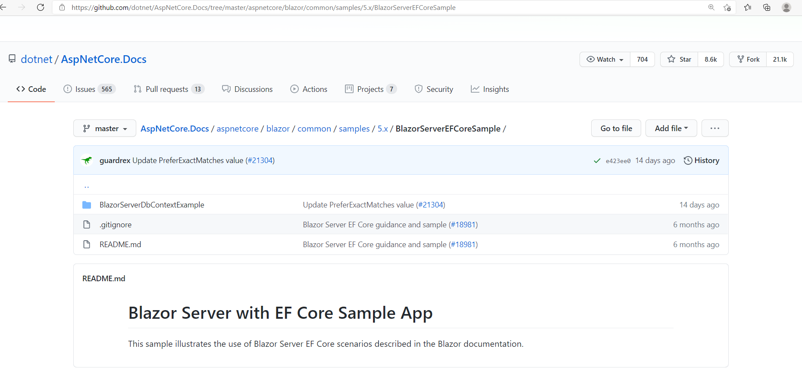

# 第1節 從範例走起
範例網址是 https://github.com/dotnet/AspNetCore.Docs/tree/master/aspnetcore/blazor/common/samples/5.x/BlazorServerEFCoreSample

## 有兩種方法
- 先 Fork 然後在本地做 clone
- 直接下載 zip 

## 進入 [第2節](A02.md)
## 回到 [第1章 目錄](Chapter01)
