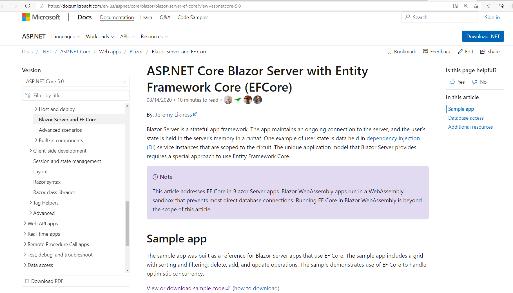

# 我們的起點是 Blazor Server EFCore
官網網址是 https://docs.microsoft.com/en-us/aspnet/core/blazor/blazor-server-ef-core?view=aspnetcore-5.0

- Blazor Server 取代傳統的 [Web Forms](https://docs.microsoft.com/en-us/aspnet/web-forms/)
- EF Core 取代傳統的 [EF 6](https://docs.microsoft.com/en-us/ef/ef6/get-started)
