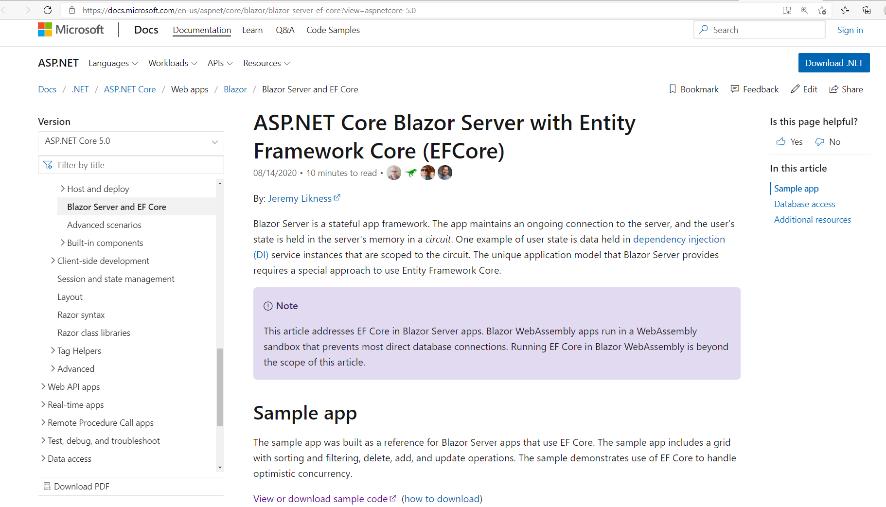

# 起點是 Blazor Server EFCore
官網截屏

## 要做的事:
- Blazor Server 取代傳統的 [Web Forms](https://docs.microsoft.com/en-us/aspnet/web-forms/)
- EF Core 取代傳統的 [EF 6](https://docs.microsoft.com/en-us/ef/ef6/get-started)

## 文檔語系:
- 英文 
  - 基準
  - [https://docs.microsoft.com/en-us/aspnet/core/blazor/blazor-server-ef-core?view=aspnetcore-5.0](https://docs.microsoft.com/en-us/aspnet/core/blazor/blazor-server-ef-core?view=aspnetcore-5.0)

- 中文繁體
  - 將上述網址的 en-us 換成 zh-tw
  - [https://docs.microsoft.com/zh-tw/aspnet/core/blazor/blazor-server-ef-core?view=aspnetcore-5.0](https://docs.microsoft.com/zh-tw/aspnet/core/blazor/blazor-server-ef-core?view=aspnetcore-5.0)

- 中文簡體
  - zh-cn
  - [https://docs.microsoft.com/zh-cn/aspnet/core/blazor/blazor-server-ef-core?view=aspnetcore-5.0](https://docs.microsoft.com/zh-cn/aspnet/core/blazor/blazor-server-ef-core?view=aspnetcore-5.0)

## 繼續
- 進入 [第1章 準備工作](Chapter01)